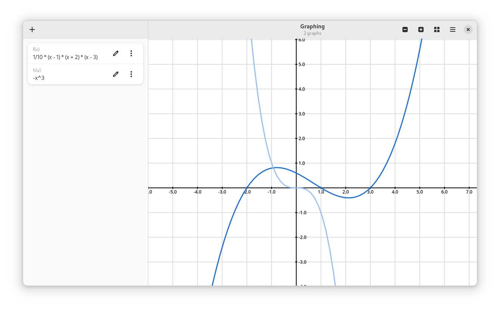

# Graphing

A simple graphing application built with owlkettle.



## Features

- Basic graphing
- Interactive viewport
- Polar Plots
- Tracing
- Supported Functions: `sin`, `cos`, `tan`, `arcsin`, `arccos`, `arctan`, `floor`, `ceil`, `abs`, `max`, `min`, `sqrt`, `cbrt`, `ln`
- Operators: `+`, `-`, `*`, `/`, `^` (exponentiation), `%` (modulo)
- Constants: `pi`, `e`
- Sums and Products: E.g. `sum(0, 10, n -> (-1)^n * (x^(2n)) / (prod(1, 2n, i -> i)))`
- Lambda expressions: E.g. `(x -> x ^ 2)(x - 1)`
- Compute exact derivatives: E.g. `(x -> x ^ 3 - 2x)'(x)`
- Copy functions as $\LaTeX$
- Export graphs as images

## Installation

```bash
nimble install https://github.com/can-lehmann/Graphing
```

### Building from source

```bash
git clone https://github.com/can-lehmann/Graphing
cd Graphing
nimble build
```

## License

Graphing is licensed under the MIT license.
See `LICENSE.txt` for more information.

